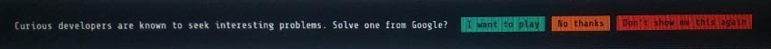
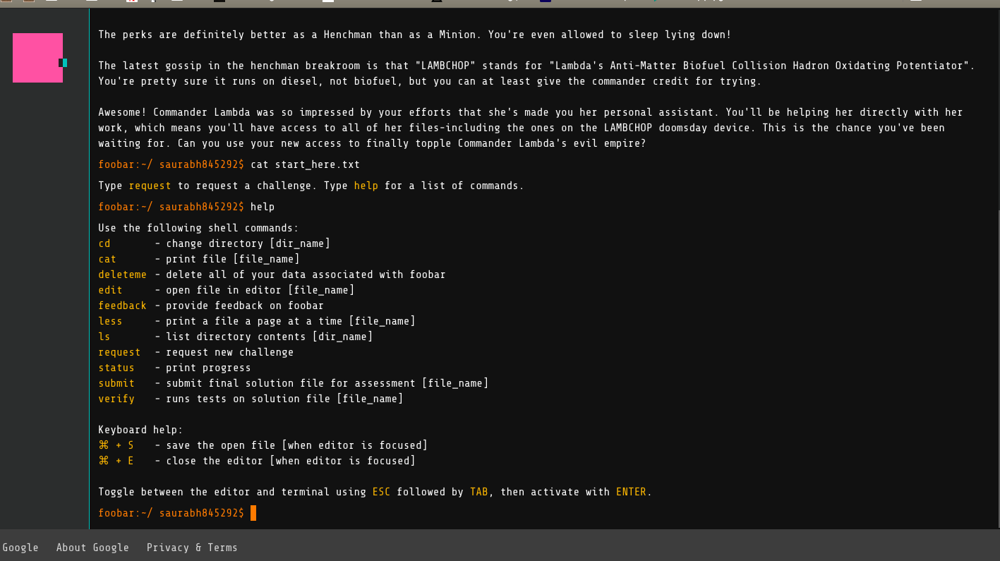

I was looking to purchase "High Performance Python", when I Googled the book, I stumbled upon this.

## **About Google Foobar**

[Google Foobar](https://foobar.withgoogle.com/) is a Google's secret invitation based programming challenge. 
There are two ways to get invited:

+ You get a sort of popup when search on Google. This is based on your search history.
+ Someone who has already been invited can refer to you after they complete Level 2.

You can submit solutions to problems in either JAVA or Python. 
You can submit the solution for problem in the given time frame **as many times as you wish**. 
Also you are told after submission how many test-cases are passing and failing.

There are 5 levels in Foobar challenge.

### **First level**

You are given 48 hours to complete this level. 
There is only one problem to be solved in this level. 
I was asked to convert text to binary, you can think of this as encoding data. Instead of ASCII or standard encoding techniques, the question asked to use Braille for encoding the text.

### **Second level**

You are given 72 hours to complete this level. 
There are two problems to be solved in this level. 
I was asked these questions:

1. Some variation of maximum sum subset in an integer array.
2. Minimum distance problem - I don't recall exact problem statement but I used BFS to solve.

&nbsp;

**After second level, you get to invite a friend!** Yay!

I haven't yet taken the next levels! 
What that means is, there is no restriction on time **between** the rounds. 
The timer starts only when you request the challenge.

### **Third level**

You are given 7 days to solve **each** problem. 
There are three problems to be solved in this level.

I'll add the questions when I start the challenge.

&nbsp;

Stay tuned for more content!

&nbsp;

Glimpse of Foobar interface.

Invitation:

